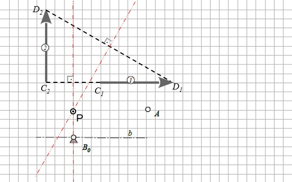
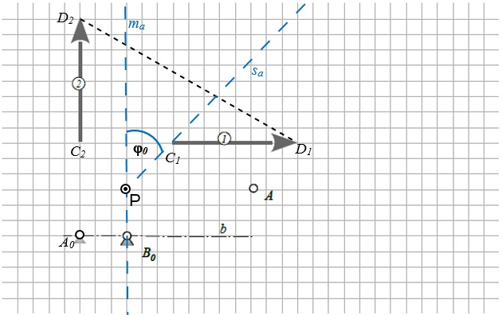
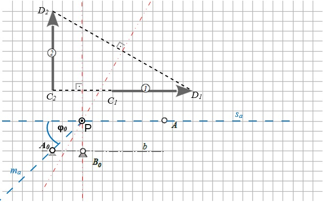
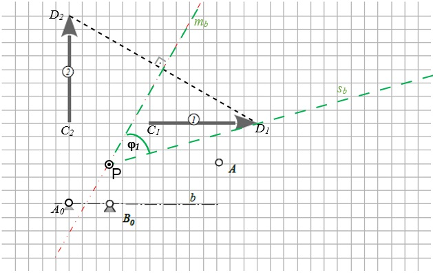
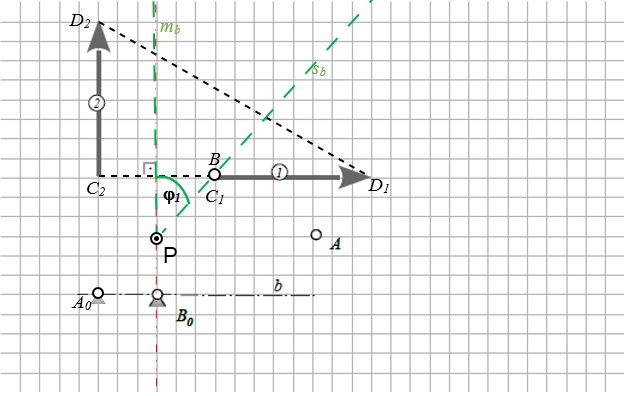

# ***Aufgabe 4***:

## Zweilagen Synthese

### Für die zwei Lagen des abgebildeten Pfeils sind der Gestellpunkt $A_0$ und der Gliedpunkt $B$ eines Viergelenkgetriebes zu ermitteln. Der Gliedpunkt soll hierbei auf der Pfeilgeraden und der Gestellpunkt auf Linie $b$ liegen.

 
 

### Zeichnen Sie das vollständige Viergelenk in beiden Stellungen.

 
 

<figure>
  
  <figcaption></figcaption>
</figure>

 
 
<!---
<figure>
  
  <figcaption></figcaption>
</figure>
-->

 
 

## _Lösung:_

* Zuerst verbindet man die beiden Pfeilspitzen ($D_1 \rightarrow D_2$) mit einer Geraden und zeichnet die  erste Mittelsenkrechte ein. Dasselbe macht man mit den Anfangspunkten der Pfeile ($C_1 \rightarrow C_2$), wo man auch die zweite Mittelsenkrechte einzeichnet. 

* Unser Punkt P ist der Schnittpunkt der beiden Mittelsenkrechten, um den wir später drehen werden, um die gesuchten Punkte zu bestimmen.

<figure>
  
  <figcaption>Punkt P</figcaption>
</figure>

Vorgehensweise zur Bestimmung vom Gestellpunkt $A_0$:

 * Hierfür muss zunächst der Polwinkel $\varphi_0$ bestimmt werden. Dafür brauchen wir einen Schenkel $\color{#5858FA}s_a$, der durch den Punkt P und durch den Gliedpunkt der ersten Gliedlänge ($C_1$) geht.

 * Da unser Schenkel durch den Punkt $C_1$ verläuft, nehmen wir auch die dazugehörige Mittelsenkrechte von der Strecke $C_1$ zu $C_2$, denn an dieser verläuft unsere Mittellinie $\color{#5858FA}m_a$. Der eingeschlossene Winkel dieser beiden Geraden ist unser Polwinkel $\varphi_0$.

<figure>
  
  <figcaption>Bestimmung des ersten Polwinkels</figcaption>
</figure>

 
 

* Nun drehen wir unsere beiden Geraden mit dem Winkel $\varphi_0$, bis unser Schenkel $\color{#5858FA}s_a$ durch den Punkt $A$ verläuft.

* Unser Gestellpunkt $A_0$ muss auf der Mittellinie $\color{#5858FA}m_a$ liegen.

* Da wir aus der Aufgabenstellung entnehmen können, dass unser Gestellpunkt auch auf der Linie $b$ liegen muss, zeichnen wir diesen auch dort ein, wo sich die Geraden $\color{#5858FA}m_a$ und $b$  kreuzen.

<figure>
  
  <figcaption>Bestimmung des Gestellpunkts </figcaption>
</figure>

 
 

Vorgehensweise zur Bestimmung des Gliedpunkts $B$:

* Hier bestimmen wir zunächst wieder den Polwinkel, hier genannt $\varphi_1$.

* Der Schenkel $\color{#01DF01}s_b$ verläuft durch die Punkte P und $D_1$. Dazu nehmen wir die Mittellinie $\color{#01DF01}m_b$ zwischen der Strecke $D_1$ zu $D_2$. Der eingeschlossene Winkel dieser beiden Gerade ist unser $\varphi_1$.

<figure>
  
  <figcaption>Bestimmung des zweiten Polwinkels</figcaption>
</figure>

 
 

* Hier drehen wir wieder die beiden Geraden um Punkt P.

* Analog zum ersten Polwinkel muss auch hier der Gestellpunkt $B_0$ auf der Mittellinie $\color{#01DF01}m_b$ liegen und der Gliedpunkt $B$ irgendwo auf dem Schenkel  $\color{#01DF01}s_b$.

* Durch die Bedingung in der Aufgabenstellung, dass der Gliedpunkt $B$ auf einer Pfeilgeraden liegen muss, können wir diesen einzeichnen, an der Stelle, wo sich die beiden Geraden kreuzen.

<figure>
  
  <figcaption>Bestimmung des Gliedpunkts B</figcaption>
</figure>

 
 

* Um auf den Punkt $A_2$ zu kommen, spiegelt man den Punkt $A$ an der Mittellinie $\color{#5858FA}m_a$. Dieser wird wie folgt eingetragen:

<figure>
  
  <figcaption>Bestimmung des Gliedpunkts A2</figcaption>
</figure>

* Um auf den Punkt $B_2$ zu kommen, spiegelt man den Punkt $B$ an der Mittellinie $\color{#01DF01}m_b$. 

<figure>
  
  <figcaption>Bestimmung des Gliedpunkts B2</figcaption>
</figure>

 
 

* Nun verbindet man die ermittelten Gelenke mit dem Gestell $A_0 \rightarrow A_2$ und $A_0 \rightarrow A$. Genauso macht man das mit dem Gestellpunkt $B_0 \rightarrow B_2$ und $B_0 \rightarrow B$. Das vollständige Viergelenk würde dann folgendermaßen aussehen:

<figure>
  
  <figcaption>Viergelenk in beiden Stellungen</figcaption>
</figure>
