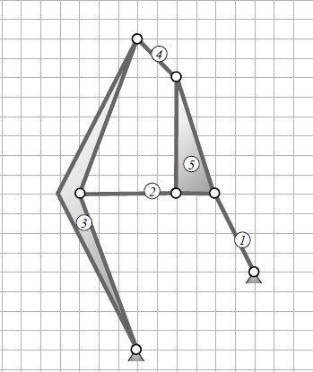

# ***Exercise 1***:

## Systematic consideration of a gearing mechanism and pole establishing

<!--- Getriebesystematische Betrachtung und Polermittlung --->

### Identify for the shown mechanism

<!---  Ermitteln Sie für den dargestellten Mechanismus    --->

<figure>
  
  <figcaption></figcaption>
</figure>

1. the degree of freedom for the whole system
2. the number of meshes
3. the associated kinematic chain (with a sketch)
4. the relatively poles $02, 04, 05, 35$ (graphical)

<!---
1. den Gesamtfreiheitsgrad
2. die Anzahl der Maschen
3. die zugehörige kinematische Kette (Skizze)
4. die Relativpole $02, 04, 05, 35$ (graphisch)
--->

## _Solution:_

### _1. the degree of freedom for the whole system_

* In the first part of the task is asked for the total degree of freedom $F$. This is calculated according to Grübler with the following formula:

<!---
* Im Aufgabenteil 1. ist nach dem Gesamtfreiheitsgrad $F$ gefragt.
Dieser wird nach Grübler mit folgender Formel berechnet:
--->

$$F=3\,(n-1)-b_1-2\,b_2$$

*  $n$ is the number of links, $b_{1}$ is the number of the monovalent and $b_{2}$ is the number for the divalent joints.

<!---
* $n$ ist hierbei die Gliederzahl, $b_{1}$ ist die Anzahl einwertiger und $b_{2}$ die Anzahl zweiwertiger Gelenke.
--->

* The number of links is composed of 0, 1, 2, 3, 4 and 5. The third and the fifth link are represented as a surface because it has more than two link joints.

<!---
* Die Gliederanzahl setzt sich aus den Gliedern 0, 1, 2, 3, 4 und 5 zusammen. Das dritte und fünfte Glied werden als Fläche dargestellt, da diese mehr als zwei Gelenkverbindungen besitzen.
--->

* We don't have a movable bearing in this mechanism $b_{1} = 0$. 

<!---
* Wir haben kein Loslager in diesem Mechanismus $b_{1} = 0$.
--->

* For the bivalent joints we have a number of $b_{2}=7$. For that the two fixed bearings and the other five joints are counted.

<!---
* Bei den zweiwertigen Gelenken sind wir bei einer Anzahl $b_{2} = 7$. Hierzu werden die zwei Festlager und die restlichen fünf Gelenke gezählt.
--->

* Our result would be:

<!---  
Somit ergibt sich:
--->

$$F=3\,(6-1)-0-2\cdot 7 = 1$$

### _2. the number of meshes_
<!---_2. Anzahl der Maschen_--->

* For the rule of meshes, the following equation applies
<!---
* Für die Maschenregel gilt folgende Gleichung: 
--->

$$m=b_1+b_2-n+1$$

* The relation of the variables from subtask 1 also apply here. So, the number of meshes would be:
<!---
* Die Beziehung der Variablen aus Teilaufgabe 1. gelten auch hier. Somit ist die Anzahl der Maschen $m$:
--->

$$m=0+7-6+1 = 2$$

### _3. the associated kinematic chain_

<!---_3. Kinematische Kette_--->

* First, you can see that we have represented two links as surfaces in the mechanism. So, these links (3 and 5) will be draw in as triangles.

<!---
* Zunächst kann man in den Mechanismus erkennen, dass wir zwei Glieder als Flächen dargestellt haben. Somit werden diese Glieder (3 und 5) als erstes in Form von Dreiecken aufgezeichnet.
--->

* You can see that the links 3 and 5 are directly connected to the links 2 and 4.
<!---
* Man kann erkennen, dass die Glieder 3 und 5 mit den Gliedern 2 und 4 direkt verbunden sind. 
--->

* Furthermore, link 0 (the environment) must be connected to link 1. Link 1 should be connected to link 5 as well.
<!---
* Desweiteren können wir sehen, dass Glied 0 (die Umgebung) mit dem Glied 1 verbunden sein muss. Glied 1 soll wiederum mit dem Glied 5 in Verbindung stehen. 
--->

* This creates the following kinematic chain:
<!---
* Somit entsteht folgende kinematische Kette:
--->

<figure>
  
  <figcaption>Stephenson's chain</figcaption>
</figure>

### _4. the relatively poles $02, 04, 05, 35$ (graphical)_

* First, we determine the apparent poles, where the links are clearly visible. The poles, which are connected by divalent joints with the environment, we label with a zero and the number of each link. Here we have 01 and 03.
<!---
* Zunächst bestimmen wir die ersichtlichen Pole, wo die Gliederverbindungen klar zu erkennen sind. Die Pole, die durch zweiwertige Gelenke mit der Umgebung verbunden sind, beschriften wir mit einer Null und der Zahl des jeweiligen Gliedes. Hier 01 und 03.
--->

* In the next step you label the link joints between the links, which are clearly visible. For example 15, 23, 25, 34 and 45.

<!---
* Im nächsten Schritt beschriftet man die Gelenkverbindungen zwischen den Gliedern, die deutlich zu erkennen sind. Zum Beispiel 15, 23, 25, 34, und 45. 
--->

* So, we have already determined 7 out of 15 relative poles.
<!---
* Somit haben wir schon 7 von 15 der Relativpole bestimmt.
--->

* To determine the remaining poles, you can create a matrix to help. You can sweep away the poles you already have.
<!---
* Zur Bestimmung der restlichen Pole, kann man sich zur Hilfe eine Matrix erstellen. Die Pole, die man schon hat, kann man wegstreichen.
--->

$$\begin{pmatrix}   \cancel{01} & 02 & \cancel{03} & 04 & 05\\
                                 & 12 & 13 & 14 & \cancel{15}\\
                        &    & \cancel{23} & 24 & \cancel{25}\\
                                &    &    & \cancel{34} & 35\\
                                 &    &    &    & \cancel{45}\\                                                            \end{pmatrix}$$

* By drawing a polygon, you can find the indefinite relative poles much faster.

<!---
* Durch das Zeichnen eines Polygons, findet man die unbestimmten Relativpole deutlich schneller.
--->

In our case, the procedure for creating a polygon would be:

<!---
Für unseren Fall würde folgendes Vorgehen für die Erstellung eines Polygons lauten:
--->

1. Drawing the 6 links as circles, starting with 0.
2. Draw in the given links (**here grey**).
3. To find a missing relative pole, you have to see this connection as a possible side of two triangles. The triangles 3, 4, 5 and 2, 3, 5   creating the pole 35 here.
4. That means that our first straight line proceed through the poles $34$ and $45$ and the second is $23$ and $25$.
5. Now we can draw in the first missing relative pole $35$ (**here red**)
6. So, we are looking for two more triangles, where a common side is missing, until we have determined the necessary relative poles.
7. For the searched pole $05$ we use the triangles 0, 1, 5 and 0, 3, 5.
8. The first straight line goes through the pole $01$ and $15$. The second through $03$ and $35$.
9. These straight lines form the intersection for the pole $05$.
10. Next we determine the unknown pole $04$. It consists of the triangles 0, 4, 5 and 0, 3, 4 in our polygon.
11. The first straight line goes through the poles $05$ and $45$ and the second through $03$ and $34$.
12. The intersection they form in the now known Pol $04$.
13. Now we determine the last pole searched $02$. This consists of the triangles 0, 2, 3 and 0, 2, 5.
14. The first straight line goes through the poles $03$ and $23$, the second through $05$ and $25$.
15. At the intersection of this line is the pole $02$.

<!---
1. Zeichnen der 6 Glieder als Kreise beginnend von 0.
2. Die gegebenen Gliedverbindungen einzeichnen (**Hier grau**)
3. Um einen fehlenden Relativpol zu finden, muss man diese Verbindung als eine mögliche Seite von zwei Dreiecken sehen. Hier aus den Dreiecken 3, 4, 5 und 2, 3, 5 ensteht der Pol $35$.
4. Das beudeutet, dass unsere erste Gerade durch die Pole $34$ und $45$ und die zweite durch $23$ und $25$ verläuft. 
5. Jetzt können wir den ersten fehlenden Relativpol $35$ einzeichnen (**Hier rot**)
6. Nun suchen wir zwei weitere Dreiecke, bei denen eine gemeinsame Seite fehlt, bis wir die nötigen Relativpole bestimmt haben.
7. Für den gesuchten Pol $05$ benutzen wir die Dreiecke 0, 1, 5 und 0, 3, 5.
8. Die erste Gerade geht durch den Pole $01$ und $15$. Die zweite durch $03$ und $35$.
9. Diese bilden den Schnittpunkt für den Pol $05$.
10. Als nächstes bestimmen wir den Unbekannten Pol $04$. Der besteht aus den Dreiecken 0, 4, 5 und 0, 3, 4 in unserem Polygon.
11. Die erste Gerade geht durch die Pole $05$ und $45$ und die zweite durch $03$ und $34$.
12. Den Schnittpunkt bilden sie in dem nun bekannten Pol $04$.
13. Nun bestimmen wir den letzten gesuchten Pol $02$. Dieser besteht aus den Dreiecken 0, 2, 3 und 0, 2, 5.
14. Die erste Gerade verläuft durch die Pole $03$ und $23$, die zweite durch $05$ und $25$.
15. Im Schnittpunkt dieser Geraden befindet sich der Pol $02$.
--->

<figure>
  
  <figcaption>Polygon</figcaption>
</figure>

* The relative poles in this mechanism are drawn in like this:

<!---
* Die Relativpole im Mechanismus werden dann wie folgt eingezeichnet:
--->
<figure>
  
  <figcaption>Relatively poles</figcaption>
</figure>