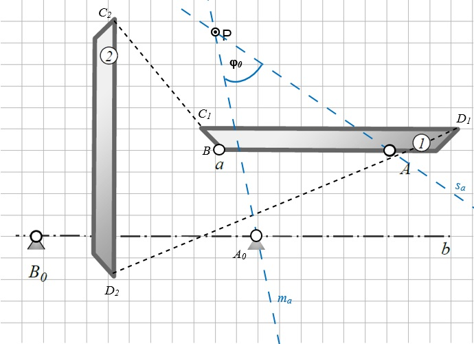
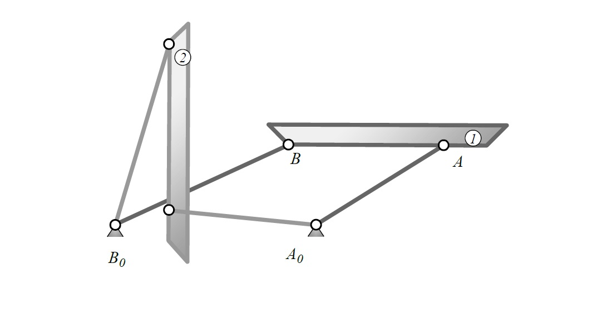

# ***Exercise 4***:

## Two-layer synthesis

<!-- Zweilagen Synthese -->

### The frame point $A_0$ and the link point $B$ of a four-bar linkage must be determined for the two end positions of the illustrated cover.

<!-- Für die zwei Endlagen des abgebildeten Deckels sind der Gestellpunkt $A_0$ und der Gliedpunkt $B$ eines Viergelenkgetriebes zu ermitteln.  -->

### The link points have to be on the straight line $a$ and the frame points on $b$.

<!-- Die Gliedpunkte sollen hierbei auf Linie $a$ und die Gestellpunkte auf Linie $b$ liegen. -->

 
 

### Draw the complete four-bar linkage in position 1.

<!-- Zeichnen Sie das vollständige Viergelenk in der Stellung 1. -->

 
 

<figure>
  
  <figcaption></figcaption>
</figure>

 
 

## _Solution:_

* First, connect the end points of the two lids ($D_1 \rightarrow D_2$) with a straight line and draw the first perpendicular bisector.

<!-- * Zuerst verbindet man die Endpunkte der beiden Deckel ($D_1 \rightarrow D_2$) mit einer Geraden und zeichnet die  erste Mittelsenkrechte ein. Das Selbe macht man mit den Anfangspunkten ($C_1 \rightarrow C_2$), wo man auch die zweite Mittelsenkrechte einzeichnet.  -->

* Our point P is the intersection of the two perpendicular bisectors, around which we will turn later to find the points which are asked in the exercise.

<!-- * Unser Punkt P ist der Schnittpunkt der beiden Mittelsenkrechten, um den wir später drehen werden, um die gesuchten Punkte zu bestimmen. -->

<figure>
  
  <figcaption>Point P</figcaption>
</figure>

Procedure for determining link point $B$:
<!-- Vorgehensweise zur Bestimmung des Gliedpunkts $B$: -->

* First we determine the pole angle $\varphi_0$.
<!-- * Wir bestimmen zunächst den Polwinkel $\varphi_0$. -->

* This is located between the leg $\color {#5858FA} s_a$, which passes through the points $P$ and $C1$, and the center line $\color {#5858FA} m_a$, which also equal the perpendicular bisector of the line $C_1$ to $C_2$. 
<!-- * Dieser befindet sich zwischen dem Schenkel $\color{#5858FA}s_a$, der durch die Punkte P und $C1$ verläuft, und der Mittellinie $\color{#5858FA}m_a$, die gleichzeitig auch die Mittelsenkrechte der Strecke $C_1$ zu $C_2$ ist. -->

<figure>
  
  <figcaption></figcaption>
</figure>

 
 

* Now we rotate the two lines with the angle $\varphi_0$ around the point P until our midline $\color {#5858FA} m_a$ intersects our frame point $B_0$.
<!-- * Nun drehen wir die beiden Geraden mit dem Winkel $\varphi_0$ um den Punkt P bis unsere Mittellinie $\color{#5858FA}m_a$ unseren Gestellpunkt $B_0$ schneidet. -->

* Since in the task is given that our link point $B$ must be somewhere on the line $a$, so it is the intersection of the leg $\color {#5858FA} s_a$ and the line $a$.
<!-- * Da in der Aufgabenstellung vorgegeben ist, dass unser Gliedpunkt $B$ irgendwo auf der Linie $a$ liegen muss, ist dieser der Schnittpunkt des Schenkels $\color{#5858FA}s_a$ und der Linie $a$. -->

<figure>
  
  <figcaption>Determination of link point</figcaption>
</figure>

 
 

Procedure for determining the frame point $A_0$:
<!-- Vorgehensweise zur Bestimmung vom Gestellpunkt $A_0$: -->

* To find out our frame point $A_0$, we turn our two lines with the angle $\ varphi_0$ until our leg $\color {#5858FA} s_a$ goes through the point A.
<!-- * Um unseren Gestellpunkt $A_0$ heraus zu finden, drehen wir unsere beiden Geraden mit dem Winkel $\varphi_0$ weiter, bis unser Schenkel $\color{#5858FA}s_a$ durch den Punkt A verläuft. -->

* Our frame point $A_0$ must be on the midline $\color {#5858FA} m_a$.
<!-- * Unser Gestellpunkt $A_0$ muss auf der Mittellinie $\color{#5858FA}m_a$ liegen. -->

* Since we know from the task that $A_0$ have to lie on the line $b$, we draw the frame point $A_0$, where the lines $\color{#5858FA}m_a$ and $b$ intersect.
<!-- * Da wir aus der Aufgabenstellung wissen, dass $A_0$ auf der Linie $b$ liegen muss, zeichnen wir diesen auch dort ein, wo sich die Geraden $\color{#5858FA}m_a$ und $b$  kreuzen. -->

<figure>
  
  <figcaption>Determination of the frame point</figcaption>
</figure>

 
 

Complete four-bar linkage
<!-- Vollständiges Viergelenk: -->

* Now you connect the determined points and links. Frame point $A_0$ have to connect with link point $A$. The same you do with the points $B_0$ and $B$. The complete four-bar linkage would look like this (the dark gray links leading to the lid 1 should be position 1):
<!-- * Nun verbindet man die ermittelten Gestellpunkte und Gliedpunkte. Gestell $A_0$ mit Gliedpunkt $A$. Genauso macht man das mit dem Gestellpunkt $B_0$ und $B$. Das vollständige Viergelenk würde dann folgendermaßen aussehen (die dunkelgrauen Glieder, die zum deckel 1 führen, sollen die Stellung 1 darstellen): -->

<figure>
  
  <figcaption></figcaption>
</figure>
